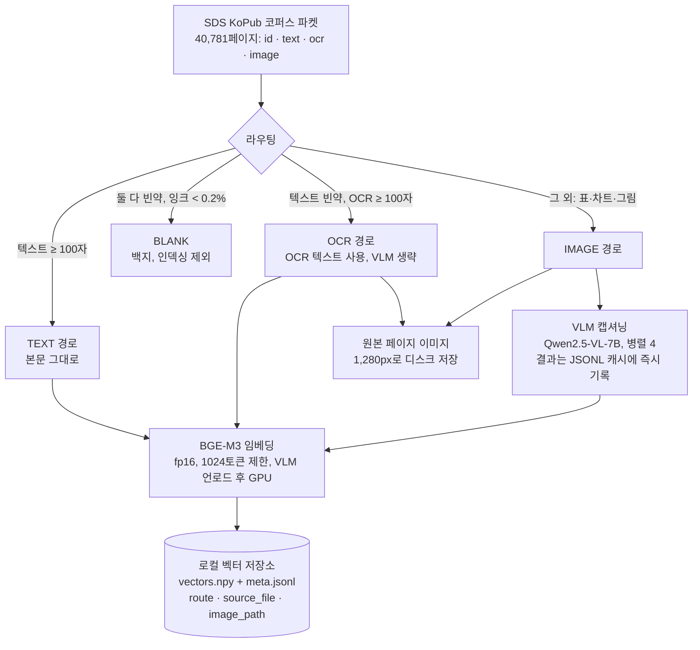
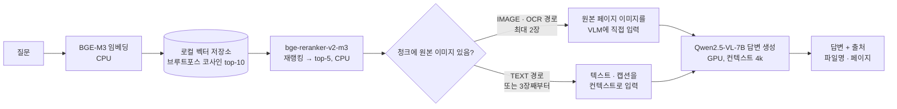

# 작업 기록

> 이 문서는 프로젝트의 목적, 구성, 파이프라인, 그리고 지금까지 한 일을 한곳에 정리한다.
> 개별 결정의 배경과 대가는 [decisions.md](decisions.md), 데이터셋 선정 근거는 [dataset.md](dataset.md), 단계별 실행 계획은 [plan.md](plan.md)에 있다.

## 1. 목적

텍스트·스캔·표·차트가 섞인 문서 묶음에 대해 질문하면, 근거 페이지를 찾아 출처와 함께 답하는 RAG를 만든다.
텍스트만 뽑는 기존 RAG는 스캔본과 표·차트 페이지를 놓친다. 이 프로젝트는 그런 페이지를 VLM(Vision Language Model)으로 읽어 검색 대상에 넣고, 답변할 때는 원본 페이지 이미지를 VLM에 직접 보여준다.

제약 조건은 두 가지다.

- **로컬 실행.** 문서를 외부 API로 보내지 않는다. 금융·공공·사내 문서처럼 반출이 안 되는 상황을 가정한다.
- **소비자용 노트북 GPU.** RTX 4070 Laptop 8GB에서 돌아야 한다. 모델 크기, 컨텍스트 길이, 처리 순서가 전부 이 제약에서 나왔다.

## 2. 환경

| 항목 | 값 |
|---|---|
| OS | Windows 11 (WSL 미설치, 관리자 권한 없음) |
| GPU | NVIDIA RTX 4070 Laptop, VRAM 8GB, CUDA 12.9 |
| CPU / RAM | Intel Core Ultra 9 185H (16코어) / 63.5GB |
| Python | 3.12, uv로 의존성 관리 |
| VLM 서빙 | Ollama 0.34, `qwen2.5vl:7b` (Q4, 6.0GB) |
| 임베딩 / 리랭킹 | BAAI/bge-m3(fp16), BAAI/bge-reranker-v2-m3 |
| 벡터 저장소 | 자체 구현 로컬 브루트포스 (numpy, D-06) |
| API | FastAPI |

## 3. 프로젝트 구성

```
multimodal-rag/
├── config.py                 전역 설정. VLM 주소·모델, 컨텍스트 길이, 라우팅 임계값, 병렬 수, 경로
├── test_vlm.py               Phase 0 검증. VLM에 표 이미지를 보내 한국어 캡션과 소요 시간 확인
│
├── indexing/                 인덱싱 (문서 → 검색 가능한 형태로 변환·저장)
│   ├── corpus.py               SDS KoPub 파켓을 스트리밍으로 읽는 리더. 40,781페이지를 메모리에 한 번에 올리지 않음
│   ├── ingest.py               라우팅. 페이지를 TEXT / OCR / IMAGE / BLANK 네 갈래로 분류
│   ├── caption.py              VLM 캡셔닝 프롬프트, 재시도, JSONL 캐시
│   ├── vector_store.py         로컬 브루트포스 벡터 저장소 (numpy, D-06). ChromaDB 대체
│   ├── embed_store.py          BGE-M3 임베딩(fp16, 1024토큰 제한) 후 vector_store에 저장. 원본 페이지 이미지 디스크 저장
│   └── run_index.py            오케스트레이터. 라우팅 → 이미지 저장 → 병렬 캡셔닝 → VLM 언로드 → GPU 임베딩
│
├── servers/                  서빙 (질문 → 답변)
│   ├── vlm_client.py           Ollama의 OpenAI 호환 API로 Qwen2.5-VL 호출. 이미지 1,280px 축소
│   ├── retrieve.py             임베딩 검색 top-10 → 크로스인코더 재랭킹 → top-5
│   ├── answer.py               검색 결과로 답변 생성. 이미지 출신 청크는 원본 이미지를 VLM에 투입
│   ├── metrics.py              검색 / 재랭킹 / 생성 단계별 소요 시간 기록, p50·p95
│   └── main.py                 FastAPI. POST /ask, GET /health, GET /metrics
│
├── eval/                     평가 (Phase 3, 미착수)
├── tests/test_ingest.py      라우팅 단위 테스트 4건
├── scripts/daily_commit.cmd  매일 21:00 변경이 있을 때만 커밋·푸시 (Windows 작업 스케줄러)
├── docs/                     plan.md · dataset.md · decisions.md · worklog.md(이 문서)
└── data/                     (git 제외) 코퍼스 파켓, 캡션 캐시, vector_store(벡터·메타), 렌더링된 페이지 이미지, 리포트
```

## 4. 전체 흐름

### 4-1. 인덱싱 (문서 준비, 한 번 실행)



### 4-2. 질의 (서비스, 요청마다)



## 5. 파이프라인 상세

### 5-1. 라우팅: 페이지를 네 갈래로 나눈다

| 경로 | 조건 | 처리 | 전체 코퍼스 실측 |
|---|---|---|---|
| TEXT | 추출 텍스트 100자 이상 | 본문 그대로 임베딩 | 37,074장 (90.9%) |
| OCR | 텍스트 빈약, OCR 100자 이상 | OCR 텍스트 임베딩. 스캔된 본문 페이지 | 1,387장 (3.4%) |
| BLANK | 둘 다 빈약, 400px 썸네일 잉크 비율 0.2% 미만 | 인덱싱 제외 | 1,323장 (3.2%) |
| IMAGE | 그 외. 표·차트·그림이 주인 페이지 | VLM 캡셔닝 후 캡션 임베딩 | 997장 (2.4%) |

처음 계획은 "텍스트 100자 미만이면 전부 VLM"이었다. 그대로 하면 3,707장을 캡셔닝해야 해 약 12시간이 걸린다. 코퍼스를 뜯어보니 그중 1,387장은 OCR로 이미 읽혀 있고, 1,323장은 백지였다. 진짜 VLM이 필요한 페이지는 997장이었다.

### 5-2. 캡셔닝: VLM이 페이지를 설명한다

- 프롬프트 한 줄로 고정: 한국어로 설명, 표는 마크다운으로 행·열 유지, 차트는 축·수치·추세, 영문 헤더는 번역 금지, 숫자는 그대로.
- 이미지는 긴 변 1,280px로 축소한다. 원본(2480×3505, 약 300DPI)을 그대로 넣으면 비전 토큰만 4,148개로 4k 컨텍스트를 넘는다.
- 병렬 4요청, 출력 400토큰 제한. 순차 처리 장당 11.9초 → 병렬 처리 장당 3.7~4.5초.
- 결과는 `data/captions.jsonl`에 한 줄씩 즉시 기록한다. 중간에 죽어도 재실행하면 이어서 간다. 페이지 하나가 실패해도 재시도 1회 후 OCR 텍스트로 대체하고 전체를 멈추지 않는다.

### 5-3. 임베딩과 저장

- 페이지 하나가 청크 하나다. SDS KoPub의 정답 라벨이 페이지 단위라 평가와 맞춘다.
- BGE-M3 dense 벡터(1,024차원, 정규화)만 쓴다. 기존 하이브리드 검색 프로젝트에서 BM25 축의 기여가 통계적으로 유의하지 않았던 결과를 승계한다.
- fp16 + 최대 시퀀스 길이 1024토큰으로 인코딩한다(D-05). 메타데이터에 `route`, `source_file`, `image_path`를 남긴다. 답변 단계에서 원본 이미지를 다시 쓰기 위해서다.
- 인덱싱 시점에는 VLM을 내린 뒤 GPU로 임베딩한다. 서빙 시점에는 VLM이 GPU를 쓰므로 임베더와 리랭커는 CPU에서 돈다.
- 저장은 ChromaDB가 아니라 자체 구현한 numpy 브루트포스 벡터 저장소를 쓴다(D-06). 이 코퍼스 규모(약 4만 벡터, 161MB)에서는 ANN 인덱스가 필요 없고, ChromaDB의 Windows 대규모 저장 버그를 원천적으로 피한다.

### 5-4. 검색과 답변

- 검색: 질문 임베딩 → 로컬 벡터 저장소 코사인 top-10(브루트포스) → 크로스인코더 재랭킹 → top-5.
- 답변: IMAGE·OCR 경로 청크는 캡션 대신 **원본 페이지 이미지**를 VLM에 넣는다. 4k 컨텍스트 때문에 최대 2장까지만 넣고, 나머지는 텍스트로 넣는다.
- 시스템 프롬프트: 문서에 근거해서만 답하고, 없으면 "문서에서 찾을 수 없습니다", 끝에 출처 표기.
- 운영 처리: VLM 서버가 죽으면 503과 명확한 메시지, 검색 결과 0건이면 예외 없이 "찾을 수 없습니다" 정상 응답, 요청마다 검색·재랭킹·생성 시간 기록.

## 6. 주요 결정 요약

전체 배경과 대가는 [decisions.md](decisions.md) 참고.

| 번호 | 결정 | 이유 | 대가 |
|---|---|---|---|
| D-01 | vLLM → Ollama | Windows, WSL 없음. vLLM은 Linux 전용 | 연속 배칭 없음. 병렬 요청으로 보완 |
| D-02 | VLM 7B 유지, 컨텍스트 8k → 4k | 8GB에 7B Q4가 겨우 들어감. 3B는 표 숫자 정확도가 떨어짐 | 답변 시 원본 이미지 최대 2장. 인덱싱은 VLM → 임베딩 순차 |
| D-03 | 코퍼스 SDS KoPub VDR 1차, DART 2차 | 한국어, 4만 페이지, 정답 라벨 600쌍, 재배포 가능 라이선스 | 전체 캡셔닝 불가 → 이미지 경로 상한 |
| D-04 | 라우팅 4갈래 + 병렬 캡셔닝 | 캡셔닝 12시간 → 1시간 목표 | OCR 경로 표는 구조가 평탄화됨. 백지 임계값은 84장 표본 기준 |
| D-05 | 임베딩 fp16 + 최대 1024토큰 + 배치 128 | 배치당 7~8초(GPU 100%인데도 느림) → 3.2초, 4배 개선 | 2,747자 넘는 긴 텍스트는 뒷부분 절단 |
| D-06 | ChromaDB → 자체 numpy 브루트포스 저장소 | ChromaDB 1.5.9가 Windows+대규모(39,458건)에서 인덱스 파일을 완전히 못 씀(미해결 공개 버그). 0.5.x는 Windows 빌드 도구 없어 설치 불가 | ANN이 아니므로 수백만 건 규모로는 안 맞음. 이 규모(4만 건)에서는 문제없음 |

## 7. 실측 수치

### Phase 0: VLM 단독 (합성 표 이미지 1장)

| 항목 | 값 |
|---|---|
| 캡션 소요 | 8.9초 |
| 표 숫자 정확도 | 6개 셀 전부 정확 (1,240 / +8.2%, 560 / -2.1%, 890 / +3.4%) |

### 500페이지 스모크 테스트 (라우팅 2갈래 → 4갈래 전후)

| 항목 | 2갈래 (초기) | 4갈래 (개선 후) |
|---|---|---|
| VLM 대상 | 38장 | 3장 (OCR 21, 백지 14로 분리) |
| 캡션 장당 | 11.9초 (순차) | 4.0초 (병렬 4) |
| 전체 소요 | 약 9분 | 82초 |
| 검색·답변 | "경제 안보 정책" 질의에 CSIS 정책간담회 문서 최상위, 출처 5건 정확 | 동일 |

### 캡셔닝 처리량 실험 (12장, 실제 코퍼스 이미지)

| 설정 | 장당 | 비고 |
|---|---|---|
| 순차 | 11.9초 | 출력 길이가 지배. 549토큰 페이지는 17.6초 |
| 병렬 3 | 4.5초 | 처리량 2.4배 |
| 병렬 4 | 3.7초 | 채택 |
| 병렬 6 | 3.5초 | 포화. VRAM 최대 6.66GB |
| 전량 GPU 강제 (num_gpu=99) | 변화 없음 | Ollama가 15%를 CPU에 유지. 메모리 추정기가 보수적 |
| 이미지 1,024px | 프리필 1,592 → 1,173토큰 | 장당 0.3초 이득. 작은 글씨 위험 대비 이득이 작아 미채택 |

### 임베딩 저장 속도 개선 (D-05)

| 설정 | 배치당 | 건당 | 3,000페이지(2,929청크) 전체 |
|---|---|---|---|
| 기본(max_seq_length 8192, fp32, 배치 64) | 7~8초 | 117ms | 약 3.4분(추정 617배치) |
| fp16 + 1024토큰 제한 + 배치 128 | 3.2초 | 27ms | 80초 (23배치) |

원인은 배치 안에 긴 텍스트 하나만 있어도 전체 배치가 그 길이까지 패딩되는 것이었다. GPU가 100%인데도 느렸던 이유가 여기 있었다. p99 텍스트 길이(2,747자)를 기준으로 1024토큰이면 대부분 손실 없이 커버된다.

### ChromaDB 장애와 교체 (D-06)

39,458건 규모로 처음 인덱싱을 마친 뒤 별도 프로세스에서 검색을 확인하려 하자 `Error loading hnsw index`로 읽기 자체가 실패했다. `client.close()` 명시적 호출, 인덱스 디렉터리 확인 등으로 원인을 좁힌 결과 ChromaDB 1.5.9의 Rust 백엔드가 Windows + PersistentClient + 대규모 저장 조합에서 겪는 미해결 공개 버그였다(2,929건 규모에서는 재현되지 않음). 구버전(0.5.23)으로 우회를 시도했으나 Windows용 `chroma-hnswlib` 사전 빌드 휠이 없어 설치가 막혔다. 이 규모(약 4만 벡터, 161MB)는 애초에 ANN 인덱스가 필요 없어, `indexing/vector_store.py`에 numpy 브루트포스 코사인 검색을 직접 구현해 교체했다. 전체를 메모리에 모았다가 끝에 한 번만 디스크에 쓰므로 부분 쓰기 상태가 생길 수 없다.

### 전체 인덱싱 (40,781페이지, 완료)

| 단계 | 결과 |
|---|---|
| 라우팅 | TEXT 37,074 / OCR 1,387 / IMAGE 997 / BLANK 1,323 / 상한 초과 0 |
| 이미지 저장 | 2,384장 (IMAGE + OCR) |
| 캡셔닝 | 997장, 실패 0건 |
| 저장된 청크 | 39,458건 (vectors.npy 161MB + meta.jsonl 89MB) |
| 총 소요시간 | 37.8분 |
| 검증 | 별도 프로세스에서 검색 실행. "예산안에 포함된 지역 개발 사업 예산 규모는?" 질의에 2022년 지방 성인지예산서 종합분석 문서 4개 페이지가 상위(0.544~0.757), 무관 문서는 0.129로 분리 |

### 캡션 품질 점검 (D-07)

IMAGE 경로 997장 중 표 형식 캡션 130장에서 10장을 원본 페이지 이미지와 직접 대조했다.

| 항목 | v1(최초) | v2(프롬프트 수정 후) |
|---|---|---|
| 심각한 창작(없는 이름·숫자·URL) | 2/5 상세검토 + 추가 2건(imgur URL) | 0 |
| 자기모순(빈 페이지라면서 표 생성) | 1/5 | 0 |
| 시스템 프롬프트 누출 | 발견(추가 대조 중) | 0 |
| 표 포함 비율 | 13.0%(130/997) | 1.4%(14/997) — 정보 손실 아님, 형식 변화(항목 목록을 표로 포장하던 습관 제거) |
| 실제 수치 보존(예: 48.7%/51.3%) | 보존 | 동일하게 보존 |
| "수치 불명" 비율 | - | 3.6%(36/997), 남발 아님 |
| 캡션 길이 중앙값 | 209자 | 84자 |

997장 전체 재캡셔닝(78.8분, 실패 0건). 근거: `docs/decisions.md` D-07.

### Phase 3 검색 평가 (D-08)

SDS KoPub VDR 600문항으로 judge 없는 자동 평가(`eval/retrieval_eval.py`, Recall@k·MRR).

| 지표 | 전체 | text | cross | visual |
|---|---|---|---|---|
| Recall@1 | 41.5% | 39.8% | 47.9% | 29.2% |
| Recall@5 | 77.0% | 79.6% | 82.1% | 64.6% |
| Recall@10 | 83.0% | 85.4% | 86.3% | 74.5% |
| MRR | 0.564 | 0.562 | 0.625 | 0.438 |

**캡셔닝 효과 검증 시도**: IMAGE 경로를 OCR로 대체한 베이스라인과 비교했으나 전체 지표가 거의 동일했다.
원인은 600문항 중 정답이 실제 IMAGE 경로인 문항이 1개뿐이었기 때문(OCR 9개, 나머지 590개는 TEXT 경로) —
이 라벨셋은 캡셔닝 효과 검증에 구조적으로 부적합하다. IMAGE·OCR 경로 10문항만 따로 보면, 유일한 IMAGE
경로 정답 문항에서 우리는 1위, 베이스라인은 top-10 밖(n=1, 일반화 불가하나 방향 일치). 근거: `docs/decisions.md` D-08,
`eval/ablation_caption_vs_ocr.json`.

### Phase 3 생성 품질 채점 (D-10, D-11)

judge는 이 세션의 Claude Fable 5.1이 맡았다(생성 모델 Qwen2.5-VL과 분리, 1회성 대화형 채점).
루브릭(`eval/judge_rubric.md`, 정확성 40·완전성 25·출처 20·간결성 15)을 채점 전에 커밋해 사전등록했다.
15문항(text 5 · cross 5 · visual 5) x 2조건. 결과: `eval/generation_report.json`.

| | ours (이미지 투입) | baseline (텍스트만) |
|---|---|---|
| 평균 | 47.2 | 49.3 |
| text / cross / visual | 45.2 / 40.8 / 55.6 | 57.6 / 40.8 / 49.4 |
| 승 / 패 / 1점차 이내 | 5 / 6 / 4 | (14번 재채점 반영) |

**이 집계는 이미지 효과를 말해주지 않는다.** 15문항 중 이미지가 실제로 VLM에 들어간 문항은 3개, 그중
정답 페이지 이미지는 1번 하나다. 나머지 12문항은 두 조건의 프롬프트가 완전히 같은데도 점수가 평균
10.4점(최대 34점) 벌어졌다 — temperature 0.8의 샘플링 편차다. 정답 이미지가 들어간 1번에서만
80 vs 73으로 이미지가 도움됐고, 5위 무관 이미지가 들어간 12번은 8 vs 34로 오히려 크게 망가졗다.

채점이 대신 찾아낸 생성 단계 결함과 조치:

| 결함 | 근거 | 조치 |
|---|---|---|
| 500자 절단이 정답 표를 잘라냄 | 8번 통계는 1,238자, 12번 한도는 884~1,250자 위치 | 이미지 수 기반 동적 예산(0장 5,094자)으로 교체 → 8번 3/3 적중 |
| 무관한 이미지가 답을 망침 | 12번 5위 OCR 이미지 → 참고문헌 창작 | 이미지는 재랭킹 상위 2위만 투입 |
| 샘플링 편차로 비교 불가 | 동일 프롬프트 최대 34점 차 | temperature 0 고정 |
| 퇴행 출력 `@@@@…` | 14번. 러너를 매번 새로 띄우고 이분한 결과 컨텍스트의 CJK 호환 한자 U+F9CA('流' 호환 코드포인트) 한 글자가 트리거. 코퍼스 전체 2회 등장. 한 번 터지면 이후 요청까지 `prompt_tokens=0`으로 오염 | VLM 입력 텍스트 NFKC 정규화(정상 요약 확인), 퇴행·미처리 감지 시 모델 재시작·재시도 (D-12). 14번은 NFKC 적용 후 재생성해 재채점 |
| 답 뒤에 "찾을 수 없습니다" 자기모순 | 3·4·6번 | 미조치, 프롬프트 과제 |
| 차트 수치 접근 불가 | 11번, TEXT 경로 페이지라 이미지 미투입 | 미조치, 라우팅 과제(그림 유무 감지) |

## 8. 작업 타임라인

### 2026-09-14

| 순서 | 한 일 |
|---|---|
| 1 | 초안 계획 검토. VRAM 예산 불일치, 비전 토큰 초과 가능성, 평가 설계의 허수아비 베이스라인과 자기 채점 문제를 지적 |
| 2 | 레포 생성·연동, 일일 자동 커밋 스케줄러 등록, 커밋 규칙(타입 접두어, 한글, 명사형, 트레일러 없음) 확정 |
| 3 | 환경 확인. 계획의 전제(12GB, Linux)가 실제(8GB Laptop, Windows)와 다름을 발견. Ollama로 전환 결정 (D-01, D-02) |
| 4 | 데이터셋 조사·선정. SDS KoPub VDR 21.9GB 다운로드 (D-03) |
| 5 | Phase 0~2 구현: VLM 클라이언트, 라우팅, 캡셔닝, 임베딩·저장, 검색·재랭킹·답변, FastAPI, 지연 계측 |
| 6 | Phase 0 검증 통과 (8.9초, 숫자 정확). 500페이지 스모크 테스트에서 컨텍스트 초과 발견 → 이미지 축소로 해결 |
| 7 | 검색·답변 end-to-end 확인 |
| 8 | 캡셔닝 12시간 문제. 코퍼스 분석으로 OCR 경로·백지 분리, 병렬 4 도입 → 약 1시간으로 단축 (D-04) |
| 9 | 전체 인덱싱 시작. 임베딩 단계가 예상보다 느려(배치당 7~8초) fp16+시퀀스 길이 제한으로 개선 (D-05) |

### 2026-09-15

| 순서 | 한 일 |
|---|---|
| 10 | 재구축한 인덱스를 별도 프로세스에서 읽자 ChromaDB 인덱스 로드 실패. 조사 결과 Windows+대규모 저장 조합의 공개 미해결 버그로 확인 |
| 11 | 구버전 다운그레이드 시도, Windows 빌드 휠 부재로 실패. numpy 브루트포스 벡터 저장소로 교체 (D-06), 소규모 검증 |
| 12 | 전체 40,781페이지 재인덱싱 완료(37.8분), 별도 프로세스 검색 검증 통과 |
| 13 | IMAGE 경로 캡션 10장을 원본 이미지와 직접 대조해 표·수치 창작 문제 확인, 프롬프트 수정 후 5장 재검증으로 정상화 확인 (D-07) |
| 14 | 997장 전체 재캡셔닝(78.8분), v1·v2 8장 추가 대조로 imgur URL 창작·프롬프트 누출 등 추가 문제 발견 및 해결 확인 |
| 15 | SDS KoPub 600문항 검색 평가 구현·실행 (D-08). OCR 베이스라인과 비교해 라벨셋의 IMAGE 경로 커버리지 한계(0.17%) 발견, 10문항 축소 비교로 방향성 있는 단일 사례 확보 |

### 2026-09-16

| 순서 | 한 일 |
|---|---|
| 16 | 생성 품질 평가 15문항 표본 준비 중 답변 컨텍스트 4k 초과 발견 → 청크 500자 절단 (D-09) |
| 17 | 루브릭 사전등록 후 Claude Fable 5.1이 30개 답변 채점 (D-10). 이미지 투입 문항이 3/15뿐이고 동일 프롬프트에서 최대 34점 편차 → 집계 비교 무효 판정 |
| 18 | 채점에서 드러난 결함 수정: 동적 컨텍스트 예산, 이미지 상위 2위 제한, temperature 0 (D-11). 8번 통계 0/3→3/3 적중 확인. 14번 퇴행 출력 원인 격리 실험 |
| 19 | 14번 퇴행 원인 확정: 러너를 매번 새로 띄운 이분 실험으로 CJK 호환 한자 U+F9CA 한 글자를 특정, NFKC 정규화로 해결. 퇴행·미처리 응답 감지와 모델 자동 재시작 추가 (D-12). 14번 재채점(56 vs 18) |

커밋 38개. 각 단계는 `feat` / `fix` / `perf` / `docs` / `test` / `chore` 접두어로 나뉘어 있다.

## 9. 현재 상태와 남은 일

**끝난 것**

- Phase 0 (VLM 서빙 확인), Phase 1 (인덱싱 파이프라인), Phase 2 (검색·답변·API) 구현과 검증
- Phase 5 일부: 단계별 지연 계측, 503·빈 결과 처리
- 전체 40,781페이지 인덱싱 완료, 프로세스 재시작 후 검색 검증까지 완료
- 캡션 품질 점검 및 프롬프트 수정, 997장 전체 재캡셔닝 (D-07)
- Phase 3 검색 평가: SDS KoPub 600문항 자동 평가, OCR 베이스라인 비교, 라벨셋 한계 확인 (D-08)
- 생성 품질 채점(15문항) 및 잔여 결함 3건 원인 규명·수정: 퇴행 출력 `@@@@`(D-12), 답변 후 자기모순
  기권(D-13), 동적 컨텍스트 예산·이미지 상위 랭크 제한·temperature 0(D-11)
- TEXT 경로 차트 페이지 픽셀 휴리스틱 탐지 시도, 부정 결과로 문서화 (D-14)
- IMAGE 경로 임베딩 텍스트 문제 규명(합성 질의 194건, v2 캡션 단독이 OCR보다 약함) 및
  전사 우선 캡션 v3 + 캡션·OCR 합집합으로 수정 (D-15), 997장 v3 재캡셔닝 완료(995 성공)
- VLM 호출을 Ollama 네이티브 API로 전환 — OpenAI 호환 엔드포인트가 num_ctx·num_gpu를 무시해 모델 2층이
  CPU에 남아 있었음. 29/29층 GPU, 캡셔닝 컨텍스트 3072 (D-17)
- 평가 방식 결정: 실사용 질의셋 대신 다른 계열 모델(Claude) 판정, 기준·표본 사전 커밋, nDCG 추가 (D-18)
- v3 결과 확정 (D-19): 합성 185건 R@5 0.524 / nDCG@5 0.425 / MRR 0.402 — v2보다 낫고 OCR 단독과 동률.
  판정 42문항: SDS image는 gold를 80% 찾지만 그 페이지가 답을 담은 비율은 27%(구분지·표지가 다수),
  DART 실사용형 10문항은 R@5 0.30·무관 0.62로 회사·연도 혼동이 주 실패 원인
- BM25 하이브리드(RRF) 추가 (D-20): DART 판정 R@5 0.30→0.40, 합성 185건 R@5 0.524→0.681·MRR 0.402→0.502,
  SDS 600문항 visual 유형 R@5 0.646→0.689·MRR 0.434→0.502. 세 검증 모두 같은 방향으로 개선
- 문서명·회사/사업연도 접두어를 BM25 색인에 추가 (D-21): DART 판정 R@5 0.40→0.50(목표 달성), 무관 비율은
  0.62로 그대로(기권 게이트로 이관). SDS/합성 지표는 사전 정한 중단 기준 안에서 유지
- 기권 게이트 설계 시도 (D-22, 부정 결과): 리랭크 1위 점수·1·2위 격차·top-5 문서 다양성 세 신호 모두
  42문항에서 "정답은 통과, 오답은 차단"을 깨끗이 못 갈랐다. 검색 단계 신호만으로는 부족하다고 결론,
  생성 후 사후 검증 쪽을 다음 후보로 남기고 게이트 자체는 도입하지 않기로 결정
- Phase 5 비용 분석 문서 작성 (`docs/cost_analysis.md`)
- DART 2차 코퍼스: 다운로드 0바이트 원인 규명(Referer 헤더 누락, D-16), 5개사(삼성전자·현대자동차·
  LG화학·NAVER·카카오) 2022~2024 사업보고서 17건·8,418페이지 다운로드 및 인덱싱 완료
  (TEXT 8,326 / IMAGE 64 / BLANK 28, `data/vector_store_dart`)

**남은 것**

1. **(중단, 과제로 보류) 기권 게이트.** 단일 신호 3종 기각(D-22), 조합 규칙 하나가 유력했지만 양성
   표본 부족으로 미채택. 답 없는 질의 20~30개 추가 제작 후 재검토.
2. **차트가 있는 TEXT 경로 페이지.** DART 원본 PDF의 `fitz.get_drawings()`로 재시도 — 선택.
3. **ColQwen2 대조 실험.** IMAGE 경로 997장만 이미지 직접 임베딩해 캡션 저장소와 정면 비교 — 선택.

**README·성능평가 보고서 작성 완료:** `README.md` 최신화(D-17~D-24 반영), `docs/성능평가_보고서.md`
신규 작성 — 검색(SDS 600·합성 185·판정 42문항)·생성(15문항) 전체 결과와 한계를 정리.

**결론 정리 + 테스트 화면 (D-25):** 캡션 경유 방식의 한계를 "찾은 페이지에 답이 없음(코퍼스 성질)",
"캡션이 정보를 떨어뜨림(실측된 방식 고유 손실)", "같은 문서 안 주제 혼동(방식 무관)" 셋으로 분리해
기록. `http://localhost:8000`에 질의→근거 페이지(텍스트·이미지)→답변을 함께 보여주는 화면을 붙여
직접 대조할 수 있게 함.

**SDS 판정 42문항 최종 집계 완료 (D-23):** 현재 파이프라인(v3+하이브리드+접두어) 기준 전체 nDCG@5
0.915·R@5(등급2) 0.60·무관@5 0.27. image 유형(R@5 0.27)이 가장 약한 지점으로 남음 — 원인은 캡셔닝
품질이 아니라 IMAGE 경로 페이지 다수가 구분지·표지라 애초에 담긴 정보가 없기 때문(D-19).

**생성 품질 재채점 완료 (D-24):** 15문항 재생성·재채점 결과 ours(이미지 투입) 64.6점 vs baseline
62.5점, 격차는 거의 전부 visual 유형(66.2 vs 54.8)에서 발생 — 설계 의도와 일치. 부수적으로 D-13
자기모순 기권 수정의 사각지대(기권 문구가 실제 답과 같은 줄에 붙는 경우 안 걸러짐)를 발견해 문장
단위 처리로 수정했고, 회귀 테스트를 추가했다(21개 전체 통과).

**페이지 단위 검색의 한계 기록 (D-26):** 테스트 화면으로 직접 질의해 확인한 두 가지. (1) 캡션 텍스트
임베딩은 표지·구분지 같은 내용 없는 단일 페이지를 정답으로 돌려준다(합성 IMAGE 15문항 중 10문항).
(2) 해법으로 텍스트 RAG의 시맨틱 청킹을 옮겨 페이지를 절 단위로 묶으려 했으나, 텍스트가 없는 이미지
페이지는 유사도 경계 판정에서 빠지고, 묶은 뒤에도 텍스트·이미지 벡터를 하나로 합칠 수 없어 채택 불가.
절 단위 묶기는 문서 구조 신호(구분지·머리글·목차)로 경계를 잡는 부모–자식 구조로 가는 것이 맞다고
정리하고 과제로 남김.

**표지·구분지·목차 제거 제안 검토 + 미해결 7건 해결안·타당성 (D-27):** "표지·목차 페이지를 없애자"는
제안을 받아, 삭제 대신 `no_content` 플래그로 검색 제외하기로 정리(절 경계·절 제목 재료로 보존, 오분류
복구 용이). 이 처방은 빈 페이지가 top-5를 채우는 현상은 없애지만 정답 페이지를 끌어올리진 못하므로 절
제목 접두어·부모–자식과 묶어서 진행. 미해결 7건(빈 페이지·캡션 손실·주제 혼동·텍스트 리랭커·기권·걸침
답변·절 경계)을 현상→해결안→타당성으로 표로 기록. 코퍼스에서 절 경계 신호(머리글·구분지·"숫자. 제목"
첫 줄·DART 목차)를 실제 확인. 착수 순서 7→1→3→6→측정→4→2→5.

**절 경계·no_content 구현 및 측정 (D-28):** D-27 계획대로 항목 7(절 경계·no_content 판정,
`indexing/section_bounds.py`)·1(검색 제외)·3(BM25 절 제목 접두어)·6(답변 단계 이웃 페이지 보완)을
구현하고 실측했다. 항목 1은 역효과로 드러나 껐다 — 합성 IMAGE 질의 185건 중 83.8%는 정답 자체가
no_content 페이지라(질문이 "이 절 제목이 뭐냐"류), 검색에서 빼자 R@5가 0.524→0.092로 무너졌다.
"표지가 잡혀 내용 없는 답"이라는 원래 문제는 항목 6(답변 단계에서 다음 페이지 텍스트·이미지 보완)
으로 대신 다뤘고, 부분적으로만 통한다(정답이 바로 다음 페이지에 있을 때만). 항목 3은 구현·측정은
했지만 뚜렷한 개선은 못 봤다(SDS 600·합성 185 모두 접두어만일 때와 비슷한 수준). 최종 설정을 반영해
SDS 600 회귀 확인(R@5 0.762, 변경 전과 동일 수준), 절 경계 판정 단위 테스트 13건 추가, 전체 34건
통과. 판정 기반 재평가(DART 42문항, 생성 품질)는 비용상 이번엔 하지 않고 과제로 남겼다.

**정리 기록 (D-29):** "유사도가 높은 문서가 곧 사용자가 찾던 문서라는 보장은 없다"를 D-25~D-28의
공통 결론으로 기록. 표지 함정·같은 문서 안 주제 혼동·리랭커 실패·표지 제외 역효과 네 가지 실측이
전부 "비슷함"과 "답이 들어 있음"이 다른 성질이라는 한 문장으로 모인다. 검색은 후보 좁히기까지만,
"답인가"는 별도 단계(생성 후 검증·VLM 리랭킹·질문 유형 인식) 필요 — 셋 다 미확정 과제.

**리랭커 지연 폭주 수정 (D-30):** 실사용 질의("카카오 사업보고서 지급여력금액") 응답이 느리다는
보고를 로그로 확인 — 재랭킹 한 번에 68초(평소 17~20초). 원인은 CrossEncoder에 max_length 미설정으로
DART 긴 페이지(최대 6,660자)가 섞이면 배치 전체가 그 길이로 패딩되는 것. rerank_max_length=512로
고정해 해결. 실제 후보로 검증(수정 후 7.4초, 극단값 재현 안 됨). 테스트 서버 재기동, 전체 테스트
34건 통과.

**표·차트 구조 손실 해결 방안 검토 (D-31):** "5성급" 오독 사례(D-30 직후 발견, TEXT 경로 페이지의
2단 표가 평평하게 뭉개짐)를 계기로, 표는 마크다운(PyMuPDF find_tables, 모델 불필요)·차트는 VLM
JSON 구조화(같은 Qwen2.5-VL-7B, 프롬프트만 변경)로 분리하는 방안을 검토해 타당하다고 기록. TEXT
경로의 표 손실은 지금까지 문서화 범위 밖에 있던 새 사각지대. 구현은 하지 않고 과제로 남김.

**통제 실험: 파이프라인 자체 성능 상한 측정 (D-32):** "0.85 이상 가능한가"라는 질문에 답하려고, 표지
·구분지·표 뭉개짐 같은 구조 문제를 없앤 10페이지 문서를 직접 만들어(텍스트 5·표 3·차트 이미지 2)
운영 파이프라인 그대로 인덱싱하고 10문항으로 질의했다. Recall@1=1.00, Recall@5=1.00, 생성 정확도
10/10. 파이프라인 자체는 병목이 아니고, 지금까지의 0.60~0.76대 수치는 코퍼스 구조 문제(표지 함정·
유사도≠정답성·표 뭉개짐)가 깎아먹은 결과임을 직접 증명. 단 표본 10문항·정답 유일 설계라 실제 코퍼스
수치로 일반화 금지. 인덱싱 36.2초, 질의 10건 92.9초.
