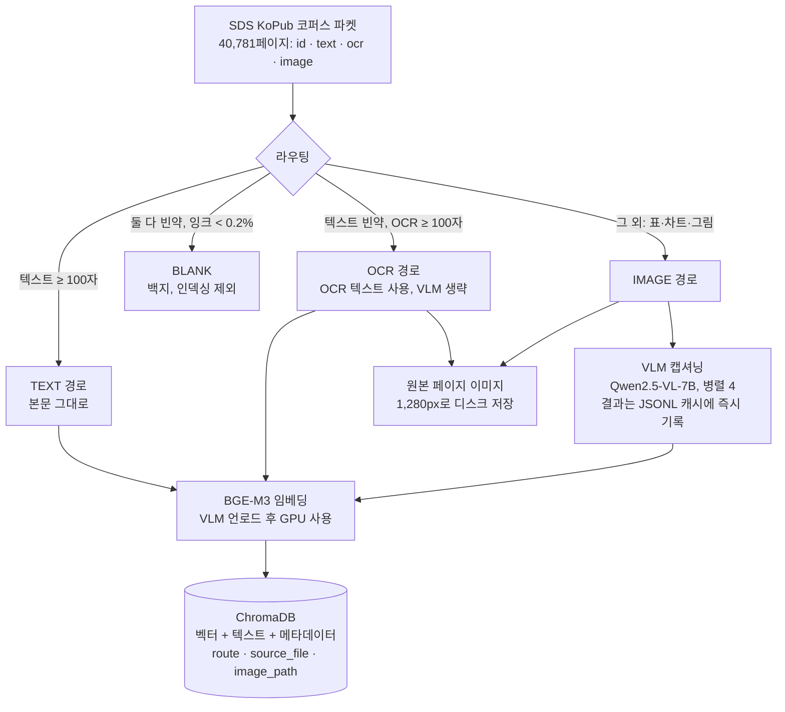
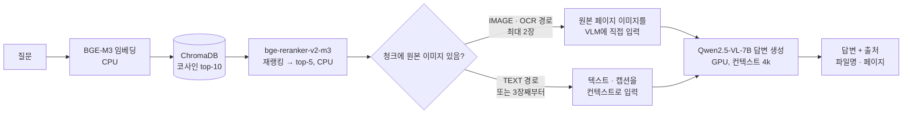

# 작업 기록

> 이 문서는 프로젝트의 목적, 구성, 파이프라인, 그리고 지금까지 한 일을 한곳에 정리한다.
> 개별 결정의 배경과 대가는 [decisions.md](decisions.md), 데이터셋 선정 근거는 [dataset.md](dataset.md), 단계별 실행 계획은 [plan.md](plan.md)에 있다.

## 1. 목적

텍스트·스캔·표·차트가 섞인 문서 묶음에 대해 질문하면, 근거 페이지를 찾아 출처와 함께 답하는 RAG를 만든다.
텍스트만 뽑는 기존 RAG는 스캔본과 표·차트 페이지를 놓친다. 이 프로젝트는 그런 페이지를 VLM(Vision Language Model)으로 읽어 검색 대상에 넣고, 답변할 때는 원본 페이지 이미지를 VLM에 직접 보여준다.

제약 조건은 두 가지다.

- **로컬 실행.** 문서를 외부 API로 보내지 않는다. 금융·공공·사내 문서처럼 반출이 안 되는 상황을 가정한다.
- **소비자용 노트북 GPU.** RTX 4070 Laptop 8GB에서 돌아야 한다. 모델 크기, 컨텍스트 길이, 처리 순서가 전부 이 제약에서 나왔다.

## 2. 환경

| 항목 | 값 |
|---|---|
| OS | Windows 11 (WSL 미설치, 관리자 권한 없음) |
| GPU | NVIDIA RTX 4070 Laptop, VRAM 8GB, CUDA 12.9 |
| CPU / RAM | Intel Core Ultra 9 185H (16코어) / 63.5GB |
| Python | 3.12, uv로 의존성 관리 |
| VLM 서빙 | Ollama 0.34, `qwen2.5vl:7b` (Q4, 6.0GB) |
| 임베딩 / 리랭킹 | BAAI/bge-m3, BAAI/bge-reranker-v2-m3 |
| 벡터 저장소 | ChromaDB (로컬 영속) |
| API | FastAPI |

## 3. 프로젝트 구성

```
multimodal-rag/
├── config.py                 전역 설정. VLM 주소·모델, 컨텍스트 길이, 라우팅 임계값, 병렬 수, 경로
├── test_vlm.py               Phase 0 검증. VLM에 표 이미지를 보내 한국어 캡션과 소요 시간 확인
│
├── indexing/                 인덱싱 (문서 → 검색 가능한 형태로 변환·저장)
│   ├── corpus.py               SDS KoPub 파켓을 스트리밍으로 읽는 리더. 40,781페이지를 메모리에 한 번에 올리지 않음
│   ├── ingest.py               라우팅. 페이지를 TEXT / OCR / IMAGE / BLANK 네 갈래로 분류
│   ├── caption.py              VLM 캡셔닝 프롬프트, 재시도, JSONL 캐시
│   ├── embed_store.py          BGE-M3 임베딩과 ChromaDB 저장. 원본 페이지 이미지 디스크 저장
│   └── run_index.py            오케스트레이터. 라우팅 → 이미지 저장 → 병렬 캡셔닝 → VLM 언로드 → GPU 임베딩
│
├── servers/                  서빙 (질문 → 답변)
│   ├── vlm_client.py           Ollama의 OpenAI 호환 API로 Qwen2.5-VL 호출. 이미지 1,280px 축소
│   ├── retrieve.py             임베딩 검색 top-10 → 크로스인코더 재랭킹 → top-5
│   ├── answer.py               검색 결과로 답변 생성. 이미지 출신 청크는 원본 이미지를 VLM에 투입
│   ├── metrics.py              검색 / 재랭킹 / 생성 단계별 소요 시간 기록, p50·p95
│   └── main.py                 FastAPI. POST /ask, GET /health, GET /metrics
│
├── eval/                     평가 (Phase 3, 미착수)
├── tests/test_ingest.py      라우팅 단위 테스트 4건
├── scripts/daily_commit.cmd  매일 21:00 변경이 있을 때만 커밋·푸시 (Windows 작업 스케줄러)
├── docs/                     plan.md · dataset.md · decisions.md · worklog.md(이 문서)
└── data/                     (git 제외) 코퍼스 파켓, 캡션 캐시, ChromaDB, 렌더링된 페이지 이미지, 리포트
```

## 4. 전체 흐름

### 4-1. 인덱싱 (문서 준비, 한 번 실행)



### 4-2. 질의 (서비스, 요청마다)



## 5. 파이프라인 상세

### 5-1. 라우팅: 페이지를 네 갈래로 나눈다

| 경로 | 조건 | 처리 | 전체 코퍼스 실측 |
|---|---|---|---|
| TEXT | 추출 텍스트 100자 이상 | 본문 그대로 임베딩 | 37,074장 (90.9%) |
| OCR | 텍스트 빈약, OCR 100자 이상 | OCR 텍스트 임베딩. 스캔된 본문 페이지 | 1,387장 (3.4%) |
| BLANK | 둘 다 빈약, 400px 썸네일 잉크 비율 0.2% 미만 | 인덱싱 제외 | 1,323장 (3.2%) |
| IMAGE | 그 외. 표·차트·그림이 주인 페이지 | VLM 캡셔닝 후 캡션 임베딩 | 997장 (2.4%) |

처음 계획은 "텍스트 100자 미만이면 전부 VLM"이었다. 그대로 하면 3,707장을 캡셔닝해야 해 약 12시간이 걸린다. 코퍼스를 뜯어보니 그중 1,387장은 OCR로 이미 읽혀 있고, 1,323장은 백지였다. 진짜 VLM이 필요한 페이지는 997장이었다.

### 5-2. 캡셔닝: VLM이 페이지를 설명한다

- 프롬프트 한 줄로 고정: 한국어로 설명, 표는 마크다운으로 행·열 유지, 차트는 축·수치·추세, 영문 헤더는 번역 금지, 숫자는 그대로.
- 이미지는 긴 변 1,280px로 축소한다. 원본(2480×3505, 약 300DPI)을 그대로 넣으면 비전 토큰만 4,148개로 4k 컨텍스트를 넘는다.
- 병렬 4요청, 출력 400토큰 제한. 순차 처리 장당 11.9초 → 병렬 처리 장당 3.7~4.5초.
- 결과는 `data/captions.jsonl`에 한 줄씩 즉시 기록한다. 중간에 죽어도 재실행하면 이어서 간다. 페이지 하나가 실패해도 재시도 1회 후 OCR 텍스트로 대체하고 전체를 멈추지 않는다.

### 5-3. 임베딩과 저장

- 페이지 하나가 청크 하나다. SDS KoPub의 정답 라벨이 페이지 단위라 평가와 맞춘다.
- BGE-M3 dense 벡터(1,024차원, 정규화)만 쓴다. 기존 하이브리드 검색 프로젝트에서 BM25 축의 기여가 통계적으로 유의하지 않았던 결과를 승계한다.
- 메타데이터에 `route`, `source_file`, `image_path`를 남긴다. 답변 단계에서 원본 이미지를 다시 쓰기 위해서다.
- 인덱싱 시점에는 VLM을 내린 뒤 GPU로 임베딩한다. 서빙 시점에는 VLM이 GPU를 쓰므로 임베더와 리랭커는 CPU에서 돈다.

### 5-4. 검색과 답변

- 검색: 질문 임베딩 → ChromaDB top-10 → 크로스인코더 재랭킹 → top-5.
- 답변: IMAGE·OCR 경로 청크는 캡션 대신 **원본 페이지 이미지**를 VLM에 넣는다. 4k 컨텍스트 때문에 최대 2장까지만 넣고, 나머지는 텍스트로 넣는다.
- 시스템 프롬프트: 문서에 근거해서만 답하고, 없으면 "문서에서 찾을 수 없습니다", 끝에 출처 표기.
- 운영 처리: VLM 서버가 죽으면 503과 명확한 메시지, 검색 결과 0건이면 예외 없이 "찾을 수 없습니다" 정상 응답, 요청마다 검색·재랭킹·생성 시간 기록.

## 6. 주요 결정 요약

전체 배경과 대가는 [decisions.md](decisions.md) 참고.

| 번호 | 결정 | 이유 | 대가 |
|---|---|---|---|
| D-01 | vLLM → Ollama | Windows, WSL 없음. vLLM은 Linux 전용 | 연속 배칭 없음. 병렬 요청으로 보완 |
| D-02 | VLM 7B 유지, 컨텍스트 8k → 4k | 8GB에 7B Q4가 겨우 들어감. 3B는 표 숫자 정확도가 떨어짐 | 답변 시 원본 이미지 최대 2장. 인덱싱은 VLM → 임베딩 순차 |
| D-03 | 코퍼스 SDS KoPub VDR 1차, DART 2차 | 한국어, 4만 페이지, 정답 라벨 600쌍, 재배포 가능 라이선스 | 전체 캡셔닝 불가 → 이미지 경로 상한 |
| D-04 | 라우팅 4갈래 + 병렬 캡셔닝 | 캡셔닝 12시간 → 1시간 목표 | OCR 경로 표는 구조가 평탄화됨. 백지 임계값은 84장 표본 기준 |

## 7. 실측 수치

### Phase 0: VLM 단독 (합성 표 이미지 1장)

| 항목 | 값 |
|---|---|
| 캡션 소요 | 8.9초 |
| 표 숫자 정확도 | 6개 셀 전부 정확 (1,240 / +8.2%, 560 / -2.1%, 890 / +3.4%) |

### 500페이지 스모크 테스트 (라우팅 2갈래 → 4갈래 전후)

| 항목 | 2갈래 (초기) | 4갈래 (개선 후) |
|---|---|---|
| VLM 대상 | 38장 | 3장 (OCR 21, 백지 14로 분리) |
| 캡션 장당 | 11.9초 (순차) | 4.0초 (병렬 4) |
| 전체 소요 | 약 9분 | 82초 |
| 검색·답변 | "경제 안보 정책" 질의에 CSIS 정책간담회 문서 최상위, 출처 5건 정확 | 동일 |

### 캡셔닝 처리량 실험 (12장, 실제 코퍼스 이미지)

| 설정 | 장당 | 비고 |
|---|---|---|
| 순차 | 11.9초 | 출력 길이가 지배. 549토큰 페이지는 17.6초 |
| 병렬 3 | 4.5초 | 처리량 2.4배 |
| 병렬 4 | 3.7초 | 채택 |
| 병렬 6 | 3.5초 | 포화. VRAM 최대 6.66GB |
| 전량 GPU 강제 (num_gpu=99) | 변화 없음 | Ollama가 15%를 CPU에 유지. 메모리 추정기가 보수적 |
| 이미지 1,024px | 프리필 1,592 → 1,173토큰 | 장당 0.3초 이득. 작은 글씨 위험 대비 이득이 작아 미채택 |

### 전체 인덱싱 (40,781페이지, 진행 중)

| 단계 | 결과 |
|---|---|
| 라우팅 | TEXT 37,074 / OCR 1,387 / IMAGE 997 / BLANK 1,323 / 상한 초과 0 |
| 이미지 저장 | 2,384장 (IMAGE + OCR) |
| 캡셔닝 | 994장 대상, 장당 4.5초, 진행 중 |
| 임베딩 | 약 39,400건 예정 |

## 8. 작업 타임라인 (2026-09-14)

| 순서 | 한 일 |
|---|---|
| 1 | 초안 계획 검토. VRAM 예산 불일치, 비전 토큰 초과 가능성, 평가 설계의 허수아비 베이스라인과 자기 채점 문제를 지적 |
| 2 | 레포 생성·연동, 일일 자동 커밋 스케줄러 등록, 커밋 규칙(타입 접두어, 한글, 명사형, 트레일러 없음) 확정 |
| 3 | 환경 확인. 계획의 전제(12GB, Linux)가 실제(8GB Laptop, Windows)와 다름을 발견. Ollama로 전환 결정 (D-01, D-02) |
| 4 | 데이터셋 조사·선정. SDS KoPub VDR 21.9GB 다운로드 (D-03) |
| 5 | Phase 0~2 구현: VLM 클라이언트, 라우팅, 캡셔닝, 임베딩·저장, 검색·재랭킹·답변, FastAPI, 지연 계측 |
| 6 | Phase 0 검증 통과 (8.9초, 숫자 정확). 500페이지 스모크 테스트에서 컨텍스트 초과 발견 → 이미지 축소로 해결 |
| 7 | 검색·답변 end-to-end 확인 |
| 8 | 캡셔닝 12시간 문제. 코퍼스 분석으로 OCR 경로·백지 분리, 병렬 4 도입 → 약 1시간으로 단축 (D-04) |
| 9 | 전체 인덱싱 시작 |

커밋 14개. 각 단계는 `feat` / `fix` / `docs` / `test` / `chore` 접두어로 나뉘어 있다.

## 9. 현재 상태와 남은 일

**끝난 것**

- Phase 0 (VLM 서빙 확인), Phase 1 (인덱싱 파이프라인), Phase 2 (검색·답변·API) 구현과 스모크 검증
- Phase 5 일부: 단계별 지연 계측, 503·빈 결과 처리

**진행 중**

- 전체 40,781페이지 인덱싱

**남은 것**

1. **Phase 3 평가.** 기존 하이브리드 검색 프로젝트의 평가 하네스(사전등록, judge 캘리브레이션, 게이트, 홀드아웃)를 이식한다. 베이스라인은 "이미지 페이지 제외"가 아니라 **같은 페이지의 OCR 텍스트**로 잡는다. judge는 피평가 VLM이 아닌 별도 모델을 쓴다. SDS KoPub의 600쌍 라벨로 검색 성능을 공개 baseline과 비교한다.
2. **캡션 품질 점검.** 표 숫자 일치율을 별도로 측정한다. 1,280px 축소가 작은 글씨에 미치는 영향을 확인한다.
3. **DART 2차 코퍼스.** 다년도 사업보고서로 방해 문서와 스캔 첨부를 추가한다.
4. **Phase 5 마무리.** 비용 분석(현행 API 모델 가격 기준, 전기료·감가 포함), README 아키텍처 다이어그램.
5. **선택.** OCR 경로 1,387장 2차 캡셔닝, ColPali 비교(8GB에서는 어려움).
